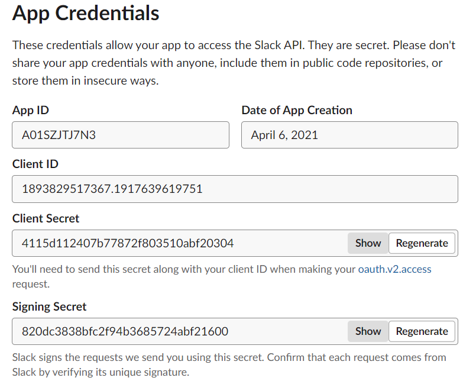
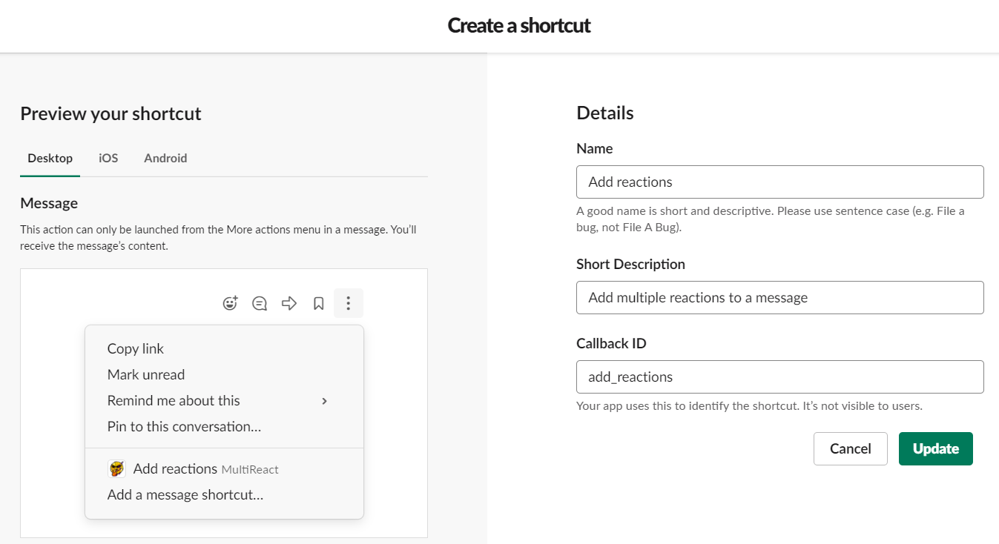
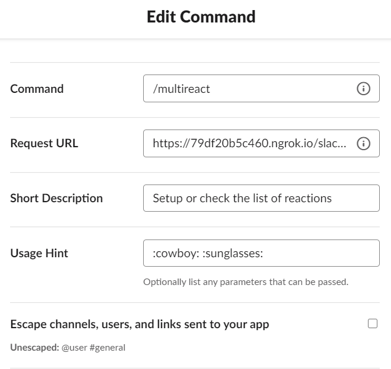
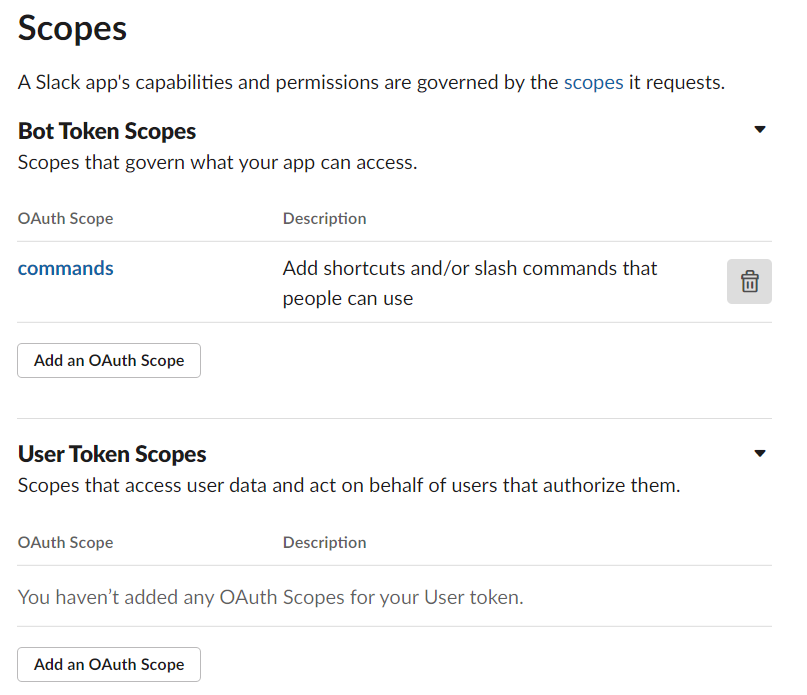

### Installation
Run the docker container and set the following environment variables:
- from the app's **Basic Information** page:
    - SLACK_SIGNING_SECRET: the **Signing Secret**
    - SLACK_CLIENT_ID: the **Client ID** 
    - SLACK_CLIENT_SECRET: the **Client Secret**
    
- FLASK_ENV: the environment for flask web server (`production` or `development`)
- APP_HOME: path to where the app data should be persisted. defaults to current directory (`.`)
- PORT: port the app should listen to incoming slack events. defaults to 3000
- LOG_LEVEL: log verosity. defaults to `INFO`
- WAITRESS_THREADS: max number of threads used to process requests. defaults to 16

#### Sample docker command
```bash
docker run --rm -it -e SLACK_SIGNING_SECRET=<signing secret> -e SLACK_CLIENT_ID=<client id> -e SLACK_CLIENT_SECRET=<client secret> -p 3000:3000 -v </local/path>:/data multireact
```

#### Required Slack App settings
- **Interactivity & Shortcuts**
    - Add `<bot address>/slack/events` to **Request URL**
    - **Create New Shortcut**
        - with **On messages** type
        - that has the Callback ID named `add_reactions`
    
- **Slash commands**
    - **Create New Command**
        - Command is `/multireact`
        - Request URL is `<bot address>/slack/events`
    
- **OAuth & Permissions**
   - **Add New Redirect URL** and use `<bot address>/slack/oauth_redirect`
   - **Scopes**
       - **Bot Token Scopes**: Add and OAuth scope for `commands` (might be already added)
       
- **App Home**
    - Disable **Messages Tab**
- **Basic Information**
    - add relevant description under **Display Information**

### Development
- Python 3.8
- ngrok

TBA
