# About

Slack bot that allows users to add multiple reactions to a message. Written in Python using [Slack Bolt for Python](https://slack.dev/bolt-python/tutorial/getting-started).


# Usage

The bot exposes two APIs: a `/multireact` [command](https://slack.com/intl/en-se/help/articles/201259356-Slash-commands-in-Slack) and a `Multireact` [message Shortcut](https://slack.com/intl/en-se/help/articles/360004063011-Work-with-apps-in-Slack-using-shortcuts#message-shortcuts).

## Examples
- `/multireact` to view saved the reactions

    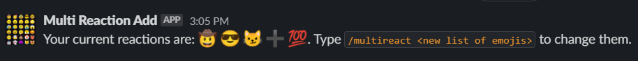

- `/multireact 🤠😎😼➕💯` to set a list of reactions

    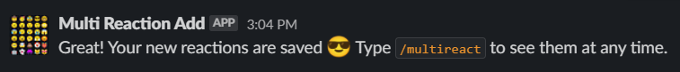

- Add reactions on a message by going to `More Actions` -> `More message shortcuts` -> `Multireact`
    1. 
    1. 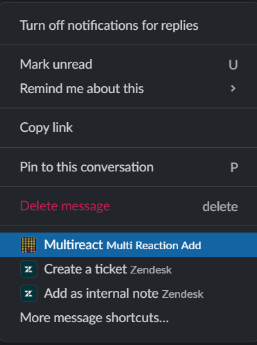
    1. 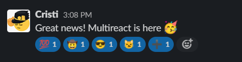


# Google Cloud deployment

The deployment process consists in creating two Google Cloud components: A Google App Engine [Service](https://cloud.google.com/appengine) and several [Buckets](https://cloud.google.com/storage/docs/key-terms#buckets).

The cloud platform must follow [King's Acceptable Use Policies](https://docs.google.com/document/d/1slOyRUquX3OSIh9uKcWQj68HwQ6czUkRMTtqV2SO9B4/edit#heading=h.j9uihjbnbt87).

## Google Storage buckets

The application requires 3 GCS buckets to store temporary data for the oauth process, app installation data for each user and another bucket for user emoji data.

Sample commands to create the buckets:
```bash
gsutil mb -c STANDARD -l europe-west1 -b on gs://multi-reaction-add-userdata

gsutil mb -c STANDARD -l europe-west1 -b on gs://multi-reaction-add-oauthstate

gsutil mb -c STANDARD -l europe-west1 -b on gs://multi-reaction-add-installation
```

Optional: set a retention policy of 1 day for the bucket that will be used for temporary OAuth tokens:

```bash
gsutil lifecycle set oauth-bucket-lifecycle.json gs://multi-reaction-add-oauthstate
```

## Google App Engine

**Note**: Cloud Build API must be enabled for the project:
```bash
gcloud services enable cloudbuild.googleapis.com
```

Initialize App Engine app for the project ([docs](https://cloud.google.com/appengine/docs/standard/python3/quickstart#additional_prerequisites)):
```bash
gcloud app create --region=europe-west --project=king-multireact-slack-app-dev
```

A new service account with the following naming convention is created: `PROJECT_ID@appspot.gserviceaccount.com` ([docs](https://cloud.google.com/appengine/docs/flexible/go/default-service-account#changing_service_account_permissions_)).

e.g.
```text
king-multireact-slack-app-dev@appspot.gserviceaccount.com
```

Grant permissions for each bucket for the App Engine service account:
```bash
gsutil iam ch serviceAccount:king-multireact-slack-app-dev@appspot.gserviceaccount.com:roles/storage.objectAdmin gs://multi-reaction-add-userdata

gsutil iam ch serviceAccount:king-multireact-slack-app-dev@appspot.gserviceaccount.com:roles/storage.objectAdmin gs://multi-reaction-add-oauthstate

gsutil iam ch serviceAccount:king-multireact-slack-app-dev@appspot.gserviceaccount.com:roles/storage.objectAdmin gs://multi-reaction-add-installation
```

Install required deployment dependencies:
```bash
gcloud components install app-engine-python
```

Copy the [app.yaml.template](app.yaml.template) files and adjust the contents in the `### Change this section` part.
```bash
cp app.yaml.template default.yaml
```

**⚠ WARNING**: The first app that is going to be deployed in the App Engine must be deployed as the `default` service ([docs](https://cloud.google.com/appengine/docs/standard/python3/configuration-files#the_default_service)).

Deploy the service:
```bash
gcloud app deploy default.yaml --project=king-multireact-slack-app-dev
```

Find the service endpoint with:
```bash
gcloud app browse --no-launch-browser --service=default
```

### Multiple apps/environments
To deploy the app multiple times in the same App Engine for different purposes (like test, stage and prod environments), copy [app.yaml.template](app.yaml.template) for each app, then change the contents in the `### Change this section` part (and the `service:` key in the file).

e.g.
```bash
cp app.yaml.template default.yaml
cp app.yaml.template sandbox.yaml
```

Deploy the app specifying each service yaml configuration file:
```bash
gcloud app deploy default.yaml sandbox.yaml --project=king-multireact-slack-app-dev
```

Find each sevice endpoint with:
```bash
gcloud app browse --no-launch-browser --service=default
gcloud app browse --no-launch-browser --service=sandbox
```

### Cleanup old services
Google App Engine is versioning each application by default and creates an endpoint for each version, then all the traffic is routed to the latest deployed service (unless specified otherwise) ([docs](https://cloud.google.com/appengine/docs/standard/python3/an-overview-of-app-engine)).

List all running versions:
```bash
gcloud app versions list
```

e.g. output
```text
SERVICE  VERSION.ID       TRAFFIC_SPLIT  LAST_DEPLOYED              SERVING_STATUS
default  20210521t201306  0.00           2021-05-21T20:14:28+02:00  SERVING
default  20210521t203524  0.00           2021-05-21T20:36:35+02:00  SERVING
default  20210521t204813  0.00           2021-05-21T20:49:12+02:00  SERVING
default  20210521t210402  1.00           2021-05-21T21:04:58+02:00  SERVING
sandbox  20210521t201306  0.00           2021-05-21T20:15:51+02:00  SERVING
sandbox  20210521t203524  0.00           2021-05-21T20:37:49+02:00  SERVING
sandbox  20210521t204813  0.00           2021-05-21T20:50:18+02:00  SERVING
sandbox  20210521t210402  1.00           2021-05-21T21:06:18+02:00  SERVING
```

The versions where the `TRAFFIC_SPLIT` is 1 represent the latest deployed application. It is safe to delete the ones where `TRAFFIC_SPLIT` is 0.

```bash
gcloud app versions delete <version>
```

One liner to delete all versions where `TRAFFIC_SPLIT` is 0:
```bash
gcloud app versions delete $(gcloud app versions list --filter=TRAFFIC_SPLIT=0 --format="value(version.id)" | sort -u | tr '\n' ' ') --quiet
```

### Troubleshooting
_Problem_: `gcloud app deploy` fails with the following error:
```text
ERROR: (gcloud.app.deploy) NOT_FOUND: Unable to retrieve P4SA: [service-236999523341@gcp-gae-service.iam.gserviceaccount.com] from GAIA. Could be GAIA propagation delay or request from deleted apps.
```
_Solution_: Try again in a few seconds.

# Create Slack application

## Interactivity & Shortcuts
- Add `<bot address>/slack/events` to **Request URL** (_can be added after the Service has been deployed - see [Google App Engine](#google-app-engine) section_)
- **Create New Shortcut**
    - with **On messages** type
    - set the Name to `Multireact`
    - add a short description
    - set the Callback ID to `add_reactions`

    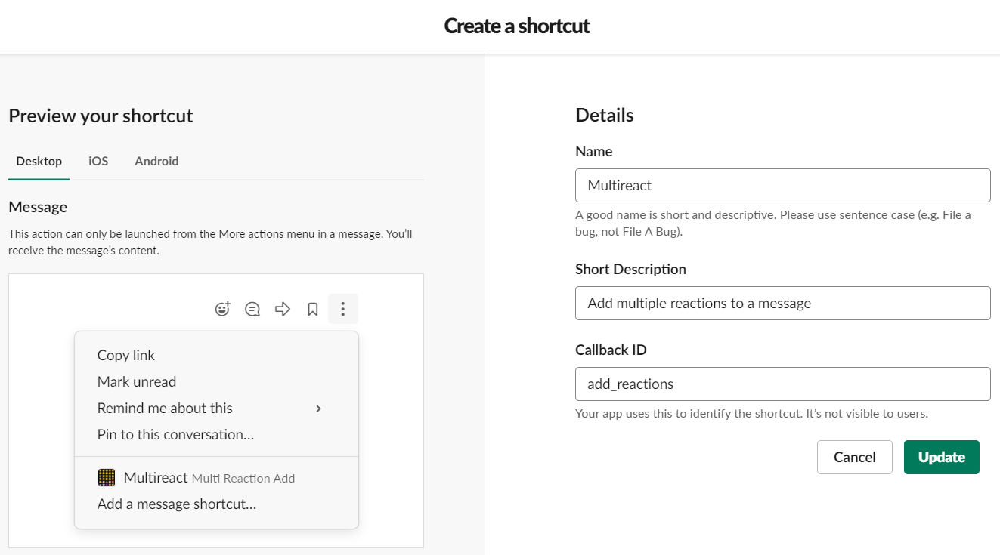

## Slash commands
- **Create New Command**
    - Command is `/multireact`
    - Request URL is `<bot address>/slack/events` (_can be added after the Service has been deployed - see [Google App Engine](#google-app-engine) section_)
    - and add a Short description and a usage hint

    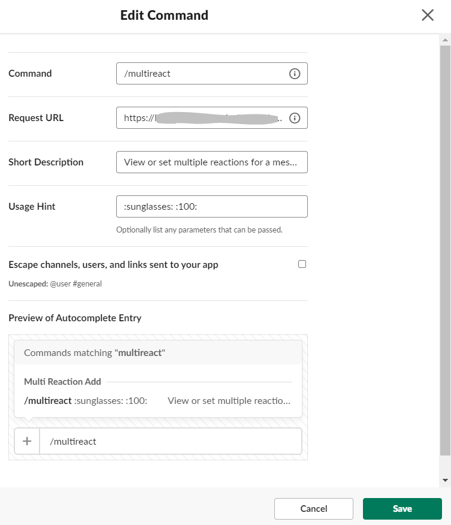

## OAuth & Permissions
- **Add New Redirect URL** and use `<bot address>/slack/oauth_redirect` (_can be added after the Service has been deployed - see [Google App Engine](#google-app-engine) section_)

    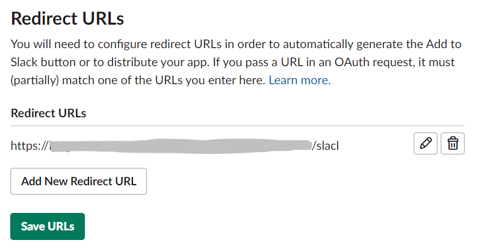
- Go to **Scopes** section and -> **Bot Token Scopes** and add an OAuth scope for `commands` (might be already added)

    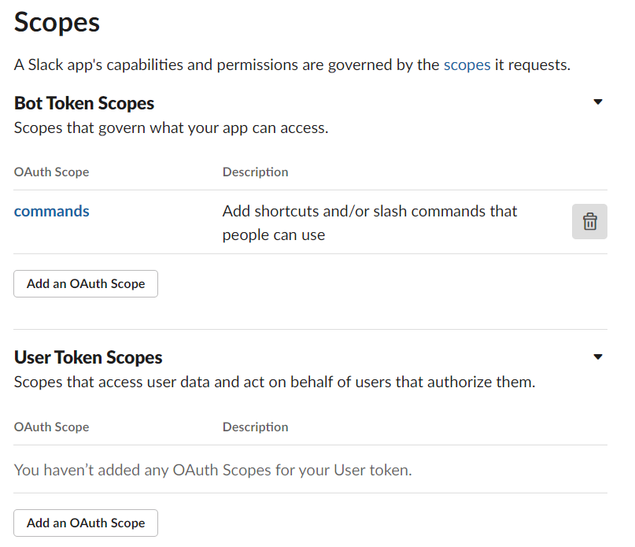

## Event Subscriptions
- enable Events

    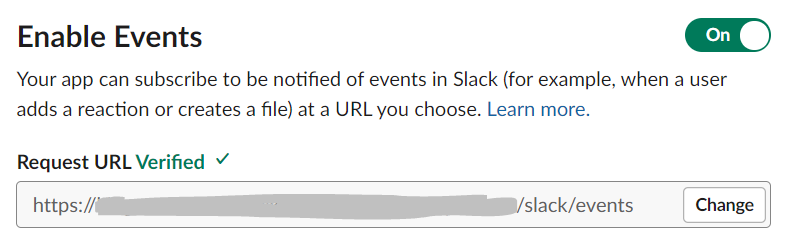
- add `<bot address>/slack/events` under Request URL (_can be added after the Service has been deployed - see [Google App Engine](#google-app-engine) section_)
- expand **Subscribe to bot events**, click on _Add Bot User Event_ and add the following events:
    - `app_home_opened`
    - `app_uninstalled`
    - `tokens_revoked`

    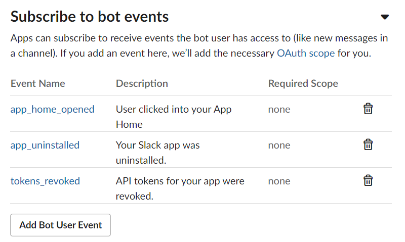

## App Home
Enable `Home Tab`

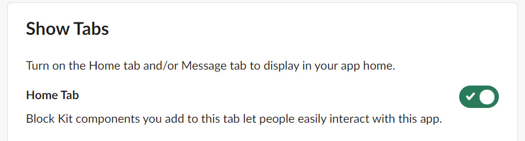

## Basic Information
Add relevant description under **Display Information**

# Environment variables

Mandatory environment variables for the App Engine Service are taken from the app's **Basic Information** page:
- SLACK_CLIENT_ID: the **Client ID** 
- SLACK_CLIENT_SECRET: the **Client Secret**
- SLACK_SIGNING_SECRET: the **Signing Secret**

    

Along with other Google Cloud variables:
- SLACK_INSTALLATION_GOOGLE_BUCKET_NAME: name of a bucket used to store Slack app install data per user
- SLACK_STATE_GOOGLE_BUCKET_NAME: bucket name for storing temporary OAuth state
- USER_DATA_BUCKET_NAME: bucket for user emoji data

Optional:
- LOG_LEVEL: log verosity. defaults to `INFO`

# Local development
To start development for this app install **Python 3.8**, [ngrok](https://ngrok.com/download) and [Google Cloud SDK](https://cloud.google.com/sdk/docs/install), then run:
- `pip install -r requirements.txt`
- in a sepparate terminal run `ngrok http 3000` and take a note of the _ngrok generated https address_
    - **note**: sometimes the VPN client will prevent ngrok from establishing a connection
- setup a slack application according to [Create Slack application](#create-slack-application) section, using _ngrok generated https address_
    - the HTTP endpoints created by Bolt framework are:
        - **/slack/events** - used as _Request URL_ for incoming slack API requests (commands and shortcuts)
        - **/slack/install** - simple interface which allows a user to install the app to a workspace and start the OAuth flow
        - **/slack/oauth_redirect** - endpoint used by Slack to complete the OAuth flow (the _Redirect URL_ under [OAuth & Permissions](#oauth-&-permissions) section)
- create GCS buckets described in [Google Storage buckets](#google-storage-buckets)
- create a service account, grant access to the Google Cloud Storage buckets (like in [Google App Engine](#google-app-engine) section), and generate a key for the account:
```bash
# create svc account
gcloud iam service-accounts create sa-multireact-dev --description="SVC account with access to GCS buckets" --display-name="SA GCS dev" --project=king-multireact-slack-app-dev

# get svc account full name
gcloud iam service-accounts list

# grant access to buckets

# generate key
gcloud iam service-accounts keys create sa-multireact-key.json --iam-account=sa-multireact-dev@king-multireact-slack-app-dev.iam.gserviceaccount.com
```
- set environment variables according to [Environment variables](#environment-variables) section, along with:
    - GOOGLE_APPLICATION_CREDENTIALS: path to a json file with credentials for an account with permissions to GCS buckets (e.g. sa-multireact-key.json)
    - PORT: optional; defaults to 3000
- `python main.py` to run the app
- go to "_ngrok generated https address_/slack/install" to install the app to the workspace and start interracting like in the [Usage](#usage) section.

## Debugging with VS Code

Use the following `.vscode/launch.json` file to setup a debug configuration for the app:
```json
{
    "version": "0.2.0",
    "configurations": [
        {
            "name": "Python: Slack Bot",
            "type": "python",
            "request": "launch",
            "program": "main.py",
            "console": "integratedTerminal",
            "env": {
                "SLACK_CLIENT_ID": "clientid",
                "SLACK_CLIENT_SECRET": "clientsecret",
                "SLACK_SIGNING_SECRET": "signingsecret",
                "LOG_LEVEL": "INFO",
                "PORT": "3000",
                "GOOGLE_APPLICATION_CREDENTIALS": "sa-multireact-key.json",
                "SLACK_INSTALLATION_GOOGLE_BUCKET_NAME": "multi-reaction-add-installation",
                "SLACK_STATE_GOOGLE_BUCKET_NAME": "multi-reaction-add-oauthstate",
                "USER_DATA_BUCKET_NAME": "multi-reaction-add-userdata"
            }
        }
    ]
}
```

Then press `F5` to start debugging.

## More

The [WSGI](https://en.wikipedia.org/wiki/Web_Server_Gateway_Interface) server of choice is [gunicorn](https://docs.gunicorn.org/en/stable/) and the application is handling requests with [aiohttp](https://docs.aiohttp.org/en/stable/), which works on top of Python's concurrent library [asyncio](https://docs.python.org/3.8/library/asyncio.html) . The choice was made based on the results shown on this [post](https://stackabuse.com/asynchronous-vs-synchronous-python-performance-analysis/#summarizingresults).

More info about how to setup a local environment can be found [here](https://slack.dev/bolt-python/tutorial/getting-started), documentation about the Slack Bolt for Python APIs can be found [here](https://slack.dev/bolt-python/concepts), and more examples on how to use the Bolt framework can be found [here](https://github.com/slackapi/bolt-python/tree/main/examples).
