# Table of contents

- [About](#about)
- [Usage](#usage)
    - [Examples](#examples)
- [Docker image](#docker-image)
- [Google Cloud deployment](#google-cloud-deployment)
    - [Google Storage Buckets](#google-storage-buckets)
    - [Google App Engine](#google-app-engine)
        - [Multiple apps or environments](#multiple-apps-or-environments)
        - [Cleanup old services](#cleanup-old-services)
        - [Troubleshooting](#troubleshooting)
- [Slack Application](#slack-application)
    - [Interactivity and Shortcuts](#interactivity-and-shortcuts)
    - [Slash commands](#slash-commands)
    - [OAuth and Permissions](#oauth-and-permissions)
    - [Event Subscriptions](#event-subscriptions)
    - [App Home](#app-home)
    - [Basic Information](#basic-information)
    - [Distributing the app](#distributing-the-app)
- [Environment variables](#environment-variables)
- [Development](#development)
    - [Debugging with VS Code](#debugging-with-vs-code)
    - [Lintint](#linting)
    - [Testing and code coverage](#testing-and-code-coverage)
    - [More](#more)

---


# About

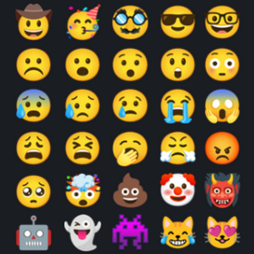

A Slack bot which allows users to add multiple reactions to a message at the same time.

> _Written in Python with [Slack Bolt for Python](https://slack.dev/bolt-python/tutorial/getting-started)._

> _Stores data in [Google Cloud Storage](https://cloud.google.com/storage/) buckets_

 

# Usage

The bot exposes two APIs: a `/multireact` [command](https://slack.com/intl/en-se/help/articles/201259356-Slash-commands-in-Slack) and a `Multireact` [message Shortcut](https://slack.com/intl/en-se/help/articles/360004063011-Work-with-apps-in-Slack-using-shortcuts#message-shortcuts).

## Examples
- `/multireact` to view saved the reactions

    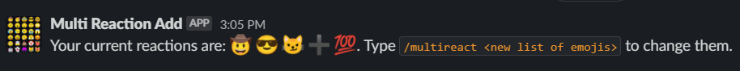

- `/multireact 🤠😎😼➕💯` to set a list of reactions

    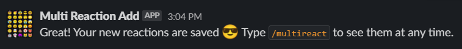

- Add reactions on a message by going to `More Actions` -> `More message shortcuts` -> `Multireact`
    1. 
    1. 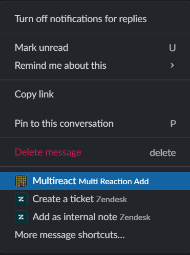
    1. 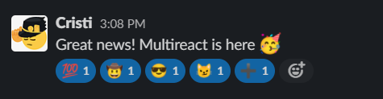

# Docker image

Run the [ccaruceru/slack-multireact](https://hub.docker.com/r/ccaruceru/slack-multireact) docker image, or build the image locally with `docker build -t multireact .`

Example:

```bash
docker run -e SLACK_CLIENT_ID=clientid -e SLACK_CLIENT_SECRET=clientsecret -e SLACK_SIGNING_SECRET=signingsecret -e SLACK_INSTALLATION_GOOGLE_BUCKET_NAME=slack-multireact-installation -e SLACK_STATE_GOOGLE_BUCKET_NAME=slack-multireact-oauthstate -e USER_DATA_BUCKET_NAME=slack-multireact-userdata -p 3000:3000 -v /path/to/sa-multireact-key.json:/credentials.json ccaruceru/slack-multireact
```

For a complete list of required environment variables, see [Environment variables](#environment-variables) section. To find out what permissions you need for the Slack bot, see [Slack Application](#slack-application) section.

# Google Cloud deployment

The deployment process consists in creating two Google Cloud components: A Google App Engine [Service](https://cloud.google.com/appengine) using [Standard](https://cloud.google.com/appengine/docs/the-appengine-environments) environment, and several [Buckets](https://cloud.google.com/storage/docs/key-terms#buckets).

## Google Storage Buckets

The application requires 3 GCS buckets to store temporary data for: the OAuth process, app installation data for each user, user emoji data.

Sample commands to create the buckets:
```bash
gsutil mb -c STANDARD -l <region> -b on gs://slack-multireact-userdata

gsutil mb -c STANDARD -l <region> -b on gs://slack-multireact-oauthstate

gsutil mb -c STANDARD -l <region> -b on gs://slack-multireact-installation
```

Optional: set a retention policy of 1 day for the bucket that will be used for temporary OAuth tokens:

```bash
gsutil lifecycle set oauth-bucket-lifecycle.json gs://slack-multireact-oauthstate
```

## Google App Engine

**ℹ Note**: Cloud Build API must be enabled for the project:
```bash
gcloud services enable cloudbuild.googleapis.com
```

Initialize App Engine app for the project ([docs](https://cloud.google.com/appengine/docs/standard/python3/quickstart#additional_prerequisites)):
```bash
gcloud app create --region=<region> --project=<project-id>
```

**ℹ Note**: It is recommended to stick to the same region as the buckets.

A new service account with the following naming convention is created: `PROJECT_ID@appspot.gserviceaccount.com` ([docs](https://cloud.google.com/appengine/docs/flexible/go/default-service-account#changing_service_account_permissions_)).

Grant permissions for each bucket for the App Engine service account:
```bash
gsutil iam ch serviceAccount:<project-id>@appspot.gserviceaccount.com:roles/storage.objectAdmin gs://slack-multireact-userdata

gsutil iam ch serviceAccount:<project-id>@appspot.gserviceaccount.com:roles/storage.objectAdmin gs://slack-multireact-oauthstate

gsutil iam ch serviceAccount:<project-id>@appspot.gserviceaccount.com:roles/storage.objectAdmin gs://slack-multireact-installation
```

Install required deployment dependencies:
```bash
gcloud components install app-engine-python
```

Copy the [app.yaml.template](app.yaml.template) files and adjust the contents in the `### Change this section` part.
```bash
cp app.yaml.template default.yaml
```

**⚠ WARNING**: The first app that is going to be deployed in the App Engine must be deployed as the `default` service ([docs](https://cloud.google.com/appengine/docs/standard/python3/configuration-files#the_default_service)).

Deploy the service:
```bash
gcloud app deploy default.yaml --project=<project-id> --version=my-version
```
where _my version_ may only contain lowercase letters, digits, and hyphens (e.g. a git tag like _1-20-0_).

Find the service endpoint with:
```bash
gcloud app browse --no-launch-browser --service=default --project=<project-id>
```

### Multiple apps or environments
To deploy the bot multiple times in the same App Engine for different purposes (like test, stage and prod environments), copy [app.yaml.template](app.yaml.template) for each app, then change the contents in the `### Change this section` part (and the `service:` key in the file).

e.g.
```bash
cp app.yaml.template default.yaml
cp app.yaml.template sandbox.yaml
```

Deploy the app specifying each yaml configuration file:
```bash
gcloud app deploy default.yaml sandbox.yaml --project=<project-id>
```

Find each sevice endpoint with:
```bash
gcloud app browse --no-launch-browser --service=default
gcloud app browse --no-launch-browser --service=sandbox
```

### Cleanup old services
Google App Engine is versioning the app for each deployment and creates an endpoint for each version, then all the traffic is routed to the latest deployed service (unless specified otherwise) ([docs](https://cloud.google.com/appengine/docs/standard/python3/an-overview-of-app-engine)).

List all running versions:
```bash
gcloud app versions list
```

e.g. output
```text
SERVICE  VERSION.ID       TRAFFIC_SPLIT  LAST_DEPLOYED              SERVING_STATUS
default  20210521t201306  0.00           2021-05-21T20:14:28+02:00  SERVING
default  20210521t203524  0.00           2021-05-21T20:36:35+02:00  SERVING
default  20210521t204813  0.00           2021-05-21T20:49:12+02:00  SERVING
default  20210521t210402  1.00           2021-05-21T21:04:58+02:00  SERVING
sandbox  20210521t201306  0.00           2021-05-21T20:15:51+02:00  SERVING
sandbox  20210521t203524  0.00           2021-05-21T20:37:49+02:00  SERVING
sandbox  20210521t204813  0.00           2021-05-21T20:50:18+02:00  SERVING
sandbox  20210521t210402  1.00           2021-05-21T21:06:18+02:00  SERVING
```

The versions where the `TRAFFIC_SPLIT` is 1.00 represent the latest deployed application. It is safe to delete the ones where `TRAFFIC_SPLIT` is 0.

```bash
gcloud app versions delete <version>
```

Or use a one liner to delete all versions where `TRAFFIC_SPLIT` is 0:
```bash
gcloud app versions delete $(gcloud app versions list --filter=TRAFFIC_SPLIT=0 --format="value(version.id)" | sort -u | tr '\n' ' ') --quiet
```

### Troubleshooting
_Problem_: `gcloud app deploy` fails with the following error:
```text
ERROR: (gcloud.app.deploy) NOT_FOUND: Unable to retrieve P4SA: [service-236999523341@gcp-gae-service.iam.gserviceaccount.com] from GAIA. Could be GAIA propagation delay or request from deleted apps.
```
_Solution_: Try again in a few seconds.

# Slack Application

The following sections must be set:

## Interactivity and Shortcuts
- Add `<bot address>/slack/events` to **Request URL** (_can be added after the Service has been deployed_)
- **Create New Shortcut**
    - with **On messages** type
    - set the Name to `Multireact`
    - add a short description
    - set the Callback ID to `add_reactions`

    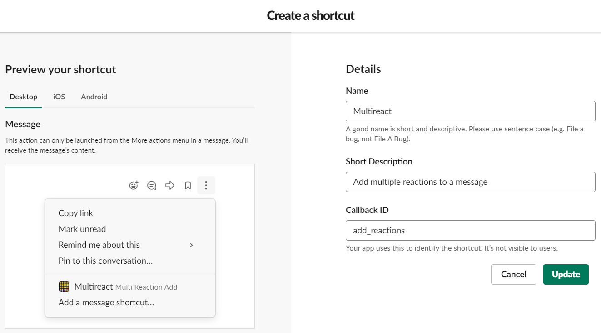

## Slash commands
- **Create New Command**
    - Command is `/multireact`
    - Request URL is `<bot address>/slack/events` (_can be added after the Service has been deployed_)
    - and add a Short description and a usage hint

    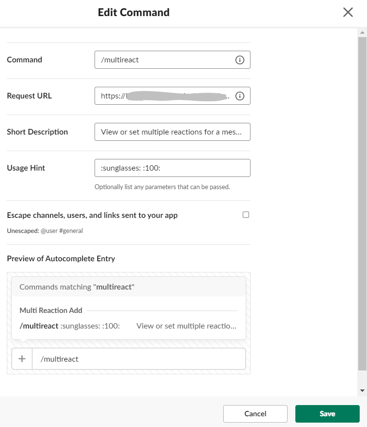

## OAuth and Permissions
- **Add New Redirect URL** and use `<bot address>/slack/oauth_redirect` (_can be added after the Service has been deployed_)

    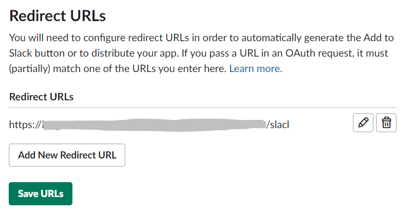
- Go to **Scopes** section and -> **Bot Token Scopes** and add an OAuth scope for `commands` (might be already added)

    
- Press the `Opt in` button to add extra security for the application

    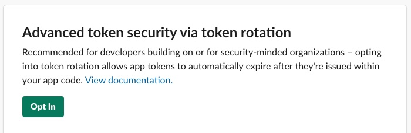

## Event Subscriptions
- enable Events

    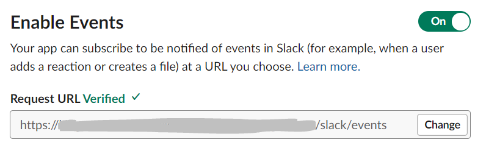
- add `<bot address>/slack/events` under Request URL (_can be added after the Service has been deployed_)
- expand **Subscribe to bot events**, click on _Add Bot User Event_ and add the following events:
    - `app_home_opened`
    - `app_uninstalled`
    - `tokens_revoked`

    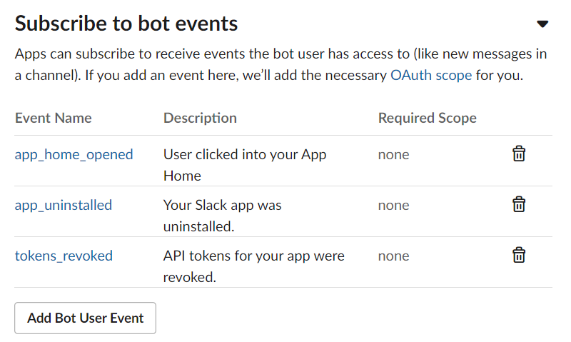

## App Home
Enable `Home Tab` and disable everything else.

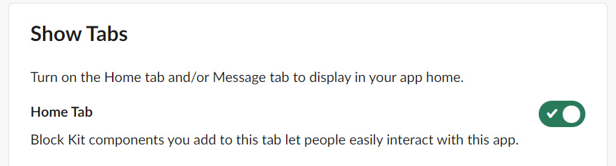

## Basic Information
Add relevant description under **Display Information**

## Distributing the app

After all information has been set and the application is deployed, users are now able to authorize and use the bot by heading to `<bot address>/slack/install` endpoint in their browsers (e.g. _https://my-multireact-app.com/slack/install_). Administrators should distribute the bot address to the users once the application is up and running (see [Docker image](#docker-image) or [Google Cloud deployment](#google-cloud-deployment) sections).

# Environment variables

Mandatory environment variables for the App Engine Service / Docker image are taken from the app's **Basic Information** page (see [Slack Application](#slack-application) section):
- SLACK_CLIENT_ID: the **Client ID** 
- SLACK_CLIENT_SECRET: the **Client Secret**
- SLACK_SIGNING_SECRET: the **Signing Secret**

    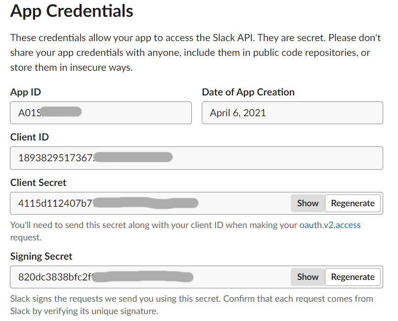

- GOOGLE_APPLICATION_CREDENTIALS: path to a json file with credentials for an account with permissions to GCS buckets (e.g. sa-multireact-key.json). Not required if the bot is running inside Google Cloud.
- SLACK_INSTALLATION_GOOGLE_BUCKET_NAME: name of a bucket used to store Slack app install data per user (e.g. slack-multireact-installation)
- SLACK_STATE_GOOGLE_BUCKET_NAME: bucket name for storing temporary OAuth state (e.g. slack-multireact-oauthstate)
- USER_DATA_BUCKET_NAME: bucket for user emoji data (e.g. slack-multireact-userdata)

Optional environment variables:
- SLACK_SLASH_COMMAND: specifies what is the slash command the app should listen for. Useful for multiple deployment in the same Slack workspace. Defaults to `/multireact`
- [Uvicorn ASGI](https://www.uvicorn.org/settings/) variables, like:
    - UVICORN_PORT: specify a server socket to bind. Defaults to `3000`.
    - UVICORN_WORKERS: the number of worker processes. Defaults to `1`.
    - UVICORN_LOG_LEVEL: log verosity. defaults to `info`.
    - UVICORN_HOST: network interfaces to bind the server. Default to `0.0.0.0`.

# Development
Make sure you have at least Python version **3.10**, [ngrok](https://ngrok.com/download) and [Google Cloud SDK](https://cloud.google.com/sdk/docs/install), then run:
- `pip install -r requirements.txt`
- in a sepparate terminal run `ngrok http 3000` and take a note of the _ngrok generated https address_
    - **ℹ Note**: if there is a VPN client running, ngrok might fail to establish a connection
- setup a slack application according to [Slack Application](#slack-application) section, using _ngrok generated https address_
    - the HTTP endpoints created by Bolt framework are:
        - **/slack/events** - used as _Request URL_ for incoming slack API requests (commands and shortcuts)
        - **/slack/install** - simple interface which allows a user to install the app to a workspace and start the OAuth flow
        - **/slack/oauth_redirect** - endpoint used by Slack to complete the OAuth flow (the _Redirect URL_ under [OAuth and Permissions](#oauth-and-permissions) section)
- create GCS buckets as described in [Google Storage buckets](#google-storage-buckets)
- create a service account, grant access to the Google Cloud Storage buckets (like in [Google App Engine](#google-app-engine) section), and generate a key for the account:
```bash
# create svc account
gcloud iam service-accounts create sa-multireact-dev --description="svc account with access to GCS buckets" --display-name="SA Multireact Dev" --project=<project-id>
# get svc account full name
gcloud iam service-accounts list
# <grant access to buckets>
# generate key
gcloud iam service-accounts keys create sa-multireact-key.json --iam-account=sa-multireact-dev@<project-id>.iam.gserviceaccount.com
```
- set environment variables according to [Environment variables](#environment-variables) section. Optionally, set a PORT number (defaults to 3000)
- `uvicorn multi_reaction_add.handlers:api --port 3000 --reload` to run the app
- go to "_ngrok generated https address_/slack/install" to install the app to the workspace and start interracting like in the [Usage](#usage) section.

## Debugging with VS Code

Use the following `.vscode/launch.json` file to setup a debug configuration for the app:
```json
{
    "version": "0.2.0",
    "configurations": [
        {
            "name": "Python: Slack Bot",
            "type": "python",
            "request": "launch",
            "module": "uvicorn",
            "args": ["multi_reaction_add.handlers:api", "--port", "3000", "--no-access-log"],
            "console": "integratedTerminal",
            "env": {
                "SLACK_CLIENT_ID": "clientid",
                "SLACK_CLIENT_SECRET": "clientsecret",
                "SLACK_SIGNING_SECRET": "signingsecret",
                "GOOGLE_APPLICATION_CREDENTIALS": "sa-multireact-key.json",
                "SLACK_INSTALLATION_GOOGLE_BUCKET_NAME": "slack-multireact-installation",
                "SLACK_STATE_GOOGLE_BUCKET_NAME": "slack-multireact-installation",
                "USER_DATA_BUCKET_NAME": "slack-multireact-installation",
                "UVICORN_LOG_LEVEL": "info"
            }
        }
    ]
}
```

Then press `F5` to start debugging.

## Linting
Use [pylint](http://pylint.pycqa.org/en/latest/tutorial.html) to run static code analysis and check if the code has well formatted docstrings according to [Google style](https://sphinxcontrib-napoleon.readthedocs.io/en/latest/example_google.html). **Code rate should always be 10.00/10**.
```bash
pip install pylint

pylint tests multi_reaction_add multi_reaction_add/oauth/installation_store/google_cloud_storage multi_reaction_add/oauth/state_store/google_cloud_storage
```

## Testing and code coverage

The [tests](tests) folder contains unit tests for the app logic. You can run the tests from commandline with:
```bash
python -m unittest discover
```

To generate a code coverage report, you need to install [coverage](https://coverage.readthedocs.io/en/coverage-5.5/) package, use it to run the tests and then you'll be able to view the coverage report. **The code coverage should always be 99%**.
```
# install package
pip install coverage

# run the tests
coverage run --source=multi_reaction_add -m unittest discover

# view report
coverage report -m
```

Use the following `.vscode/settings.json` configuration to setup testing with [unittest](https://docs.python.org/3.10/library/unittest.html) for [VS Code](https://code.visualstudio.com/docs/python/testing#_enable-a-test-framework):
```json
{
    "python.testing.unittestArgs": [
        "-v",
        "-s",
        "./tests",
        "-p",
        "test_*.py"
    ],
    "python.testing.pytestEnabled": false,
    "python.testing.nosetestsEnabled": false,
    "python.testing.unittestEnabled": true
}
```

## More

The app uses [ASGI](https://asgi.readthedocs.io/en/latest/) with [starlette](https://www.starlette.io/) and the application is handling requests with [uvicorn](https://www.uvicorn.org/), which works on top of Python's concurrent library [asyncio](https://docs.python.org/3.10/library/asyncio.html). The choice was mostly based on the results shown in this [post](https://stackabuse.com/asynchronous-vs-synchronous-python-performance-analysis/#summarizingresults).

The application exposes two additional http endpoints: `/img` for serving static images, and `/_ah/warmup` for GAE [warmup requests](https://cloud.google.com/appengine/docs/standard/python3/configuring-warmup-requests).

More info about how to setup a local environment can be found [here](https://slack.dev/bolt-python/tutorial/getting-started), documentation about the Slack Bolt for Python APIs can be found [here](https://slack.dev/bolt-python/concepts), and more examples on how to use the Bolt framework can be found [here](https://github.com/slackapi/bolt-python/tree/main/examples).
