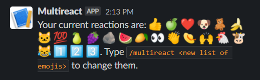
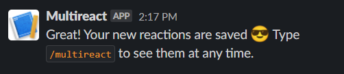
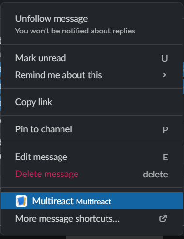
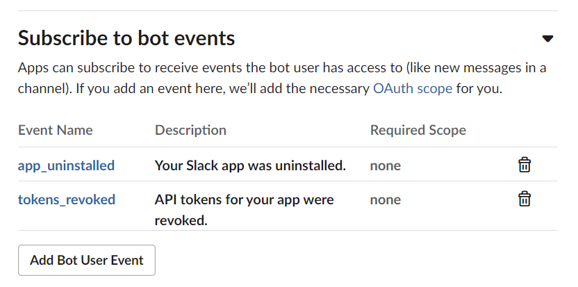

# About

Slack bot that allows users to add multiple reactions to a message. Written in Python using [Slack Bolt for Python](https://slack.dev/bolt-python/tutorial/getting-started).


# Usage

The bot exposes two APIs: a `/multireact` [command](https://slack.com/intl/en-se/help/articles/201259356-Slash-commands-in-Slack) and a `Multireact` [message Shortcut](https://slack.com/intl/en-se/help/articles/360004063011-Work-with-apps-in-Slack-using-shortcuts#message-shortcuts).

## Examples
- `/multireact` to view saved the reactions


- `/multireact 🤠😎😼➕💯` to set a list of reactions


- Add reactions on a message by going to `More Actions` -> `More message shortcuts` -> `Multireact`




# Google Cloud deployment

The deployment process consists in creating two Google Cloud components: A Google Cloud Run [Service](https://cloud.google.com/run/docs/quickstarts/build-and-deploy/python) and several [Buckets](https://cloud.google.com/storage/docs/key-terms#buckets).

The cloud platform must follow [King's Acceptable Use Policies](https://docs.google.com/document/d/1slOyRUquX3OSIh9uKcWQj68HwQ6czUkRMTtqV2SO9B4/edit#heading=h.j9uihjbnbt87).

## Google Storage buckets

The application requires 3 GCS buckets to store temporary data for the oauth process, app installation data for each user and another bucket for user emoji data.

Sample commands to create the buckets:
```bash
gsutil mb -c STANDARD -l europe-west1 -b on gs://multi-reaction-add-userdata

gsutil mb -c STANDARD -l europe-west1 -b on gs://multi-reaction-add-oauthstate

gsutil mb -c STANDARD -l europe-west1 -b on gs://multi-reaction-add-installation
```

Optional: set a retention policy of 1 day for the bucket that will be used for temporary OAuth tokens:

```bash
gsutil lifecycle set oauth-bucket-lifecycle.json gs://multi-reaction-add-oauthstate
```

## Service account

A service account must be assigned to the container to access the GCS buckets.
```bash
gcloud iam service-accounts create sa-multireact-slack-app --description="SVC account for running a service in Cloud Run for multireact slack app" --display-name="SA Multireact Slack App"
```

Get the service account full name:
```bash
gcloud iam service-accounts list
```

Grant permissions for each bucket:
```bash
gsutil iam ch serviceAccount:sa-multireact-slack-app@king-multireact-slack-app-dev.iam.gserviceaccount.com:roles/storage.objectAdmin gs://multi-reaction-add-userdata

gsutil iam ch serviceAccount:sa-multireact-slack-app@king-multireact-slack-app-dev.iam.gserviceaccount.com:roles/storage.objectAdmin gs://multi-reaction-add-oauthstate

gsutil iam ch serviceAccount:sa-multireact-slack-app@king-multireact-slack-app-dev.iam.gserviceaccount.com:roles/storage.objectAdmin gs://multi-reaction-add-installation
```

## Create Slack application

### Interactivity & Shortcuts
- Add `<bot address>/slack/events` to **Request URL** (_can be added after the Service has been deployed - see [Google Cloud Run](#google-cloud-run) section_)
- **Create New Shortcut**
    - with **On messages** type
    - that has the Callback ID named `add_reactions`


### Slash commands
- **Create New Command**
    - Command is `/multireact`
    - Request URL is `<bot address>/slack/events` (_can be added after the Service has been deployed - see [Google Cloud Run](#google-cloud-run) section_)


### OAuth & Permissions
- **Add New Redirect URL** and use `<bot address>/slack/oauth_redirect` (_can be added after the Service has been deployed - see [Google Cloud Run](#google-cloud-run) section_)
- **Scopes**
    - **Bot Token Scopes**: Add and OAuth scope for `commands` (might be already added)


### Event Subscriptions
- add `<bot address>/slack/events` under _Request URL_
- expand **Subscribe to bot events**, click on _Add Bot User Event_ and add `app_uninstalled` and `tokens_revoked` events


### App Home
Disable all options

### Basic Information
Add relevant description under **Display Information**

## Environment variables

Mandatory environment variables for the Cloud Run Service are taken from the app's **Basic Information** page:
- SLACK_CLIENT_ID: the **Client ID** 
- SLACK_CLIENT_SECRET: the **Client Secret**
- SLACK_SIGNING_SECRET: the **Signing Secret**


Along with other Google Cloud variables:
- CPUS: max number of cpus assigned for the container (must be an integer)
- SLACK_INSTALLATION_GOOGLE_BUCKET_NAME: name of a bucket used to store Slack app install data per user
- SLACK_STATE_GOOGLE_BUCKET_NAME: bucket name for storing temporary OAuth state
- USER_DATA_BUCKET_NAME: bucket for user emoji data

Optional:
- PORT: port where the app is listening. defaults to `3000`
- LOG_LEVEL: log verosity. defaults to `INFO`

### Google Cloud Run

Build the image and deploy it to [Google Cloud Registry](https://cloud.google.com/container-registry):

```bash
# login to the gcp project with "gcloud auth login"
# setup docker credentials for gcr with "gcloud auth configure-docker"
docker build -t eu.gcr.io/king-multireact-slack-app-dev/multireact-slack-app .
docker push eu.gcr.io/king-multireact-slack-app-dev/multireact-slack-app
```

Deploy the container to Google Cloud Run using the following command:
```bash
gcloud run deploy multireact-slack-app\
 --image eu.gcr.io/king-multireact-slack-app-dev/multireact-slack-app\
 --platform managed\ # Fully managed version of Cloud Run
 --cpu=2\ # CPU limit
 --memory=256Mi\ # memory limit
 --min-instances=1\ # min instances
 --max-instances=20\ # max instances
 --region=europe-west1\
 --port=3000\ # container port
 --service-account=sa-multireact-slack-app@king-multireact-slack-app-dev.iam.gserviceaccount.com\
 --update-env-vars=SLACK_CLIENT_ID=<client id>,SLACK_CLIENT_SECRET=<client secret>,SLACK_SIGNING_SECRET=<signing secret>,CPUS=2,SLACK_INSTALLATION_GOOGLE_BUCKET_NAME=multi-reaction-add-installation,SLACK_STATE_GOOGLE_BUCKET_NAME=multi-reaction-add-oauthstate,USER_DATA_BUCKET_NAME=multi-reaction-add-userdata\ # env vars
 --allow-unauthenticated # make service publicly accessible
```

**Notes**
- Google Cloud Run service must be enabled for the project.
- `--allow-unauthenticated` flag implies that the user who deploys the container has either **Owner** or **Cloud Run Admin** role in order to assing `roles/run.invoker` to `allUsers` for the deployed service, otherwise the following warning will be seen: _WARNING: Setting IAM policy failed_, and the service will fail to be exposed.

Describe the running container to get the HTTPS endpoint:
```bash
gcloud run services list
```

# Local development
To start development for this app install **Python 3.8**, [ngrok](https://ngrok.com/download) and [Google Cloud SDK](https://cloud.google.com/sdk/docs/install), then run:
- `pip install -r requirements.txt`
- in a sepparate terminal run `ngrok http 3000` and take a note of the _ngrok generated https address_
    - **note**: sometimes the VPN client will prevent ngrok from establishing a connection
- setup a slack application according to [Create Slack application](#create-slack-application) section, using _ngrok generated https address_
    - the HTTP endpoints created by Bolt framework are:
        - **/slack/events** - used as _Request URL_ for incoming slack API requests (commands and shortcuts)
        - **/slack/install** - simple interface which allows a user to install the app to a workspace and start the OAuth flow
        - **/slack/oauth_redirect** - endpoint used by Slack to complete the OAuth flow (the _Redirect URL_ under [OAuth & Permissions](#oauth-&-permissions) section)
- create GCS buckets described in [Google Storage buckets](#google-storage-buckets)
- create a service account similar to [Service account](#service-account) and generate a key for the account:
```bash
gcloud iam service-accounts keys create sa-multireact-key.json --iam-account=sa-multireact-slack-app@king-multireact-slack-app-dev.iam.gserviceaccount.com
```
- set environment variables according to [Environment variables](#environment-variables) section, along with:
    - GOOGLE_APPLICATION_CREDENTIALS: path to a json file with credentials for an account with permissions to GCS buckets (e.g. sa-multireact-key.json)
- `python main.py` to run the app
- go to "_ngrok generated https address_/slack/install" to install the app to the workspace and start interracting like in the [Usage](#usage) section.

## Debugging with VS Code

Use the following `.vscode/launch.json` file to setup a debug configuration for the app:
```json
{
    "version": "0.2.0",
    "configurations": [
        {
            "name": "Python: Slack Bot",
            "type": "python",
            "request": "launch",
            "program": "main.py",
            "console": "integratedTerminal",
            "env": {
                "SLACK_CLIENT_ID": "clientid",
                "SLACK_CLIENT_SECRET": "clientsecret",
                "SLACK_SIGNING_SECRET": "signingsecret",
                "LOG_LEVEL": "INFO",
                "PORT": "3000",
                "GOOGLE_APPLICATION_CREDENTIALS": "sa-multireact-key.json",
                "SLACK_INSTALLATION_GOOGLE_BUCKET_NAME": "multi-reaction-add-installation",
                "SLACK_STATE_GOOGLE_BUCKET_NAME": "multi-reaction-add-oauthstate",
                "USER_DATA_BUCKET_NAME": "multi-reaction-add-userdata"
            }
        }
    ]
}
```

Then press `F5` to start debugging.

## More

The [WSGI](https://en.wikipedia.org/wiki/Web_Server_Gateway_Interface) server of choice is [gunicorn](https://docs.gunicorn.org/en/stable/) and the application is handling requests with [aiohttp](https://docs.aiohttp.org/en/stable/), which works on top of Python's concurrent library [asyncio](https://docs.python.org/3.8/library/asyncio.html) . The choice was made based on the results shown on this [post](https://stackabuse.com/asynchronous-vs-synchronous-python-performance-analysis/#summarizingresults).

More info about how to setup a local environment can be found [here](https://slack.dev/bolt-python/tutorial/getting-started), documentation about the Slack Bolt for Python APIs can be found [here](https://slack.dev/bolt-python/concepts), and more examples on how to use the Bolt framework can be found [here](https://github.com/slackapi/bolt-python/tree/main/examples).
